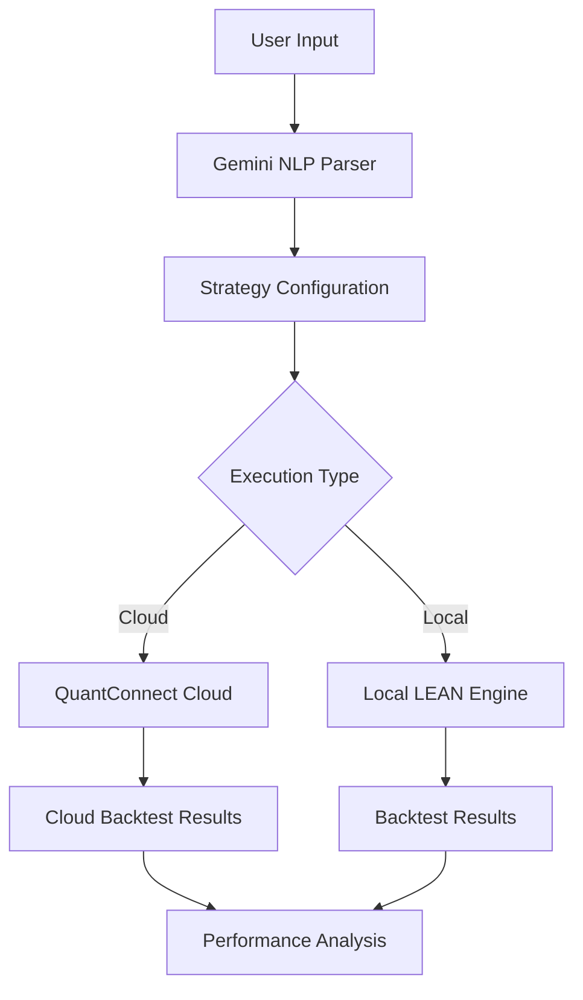
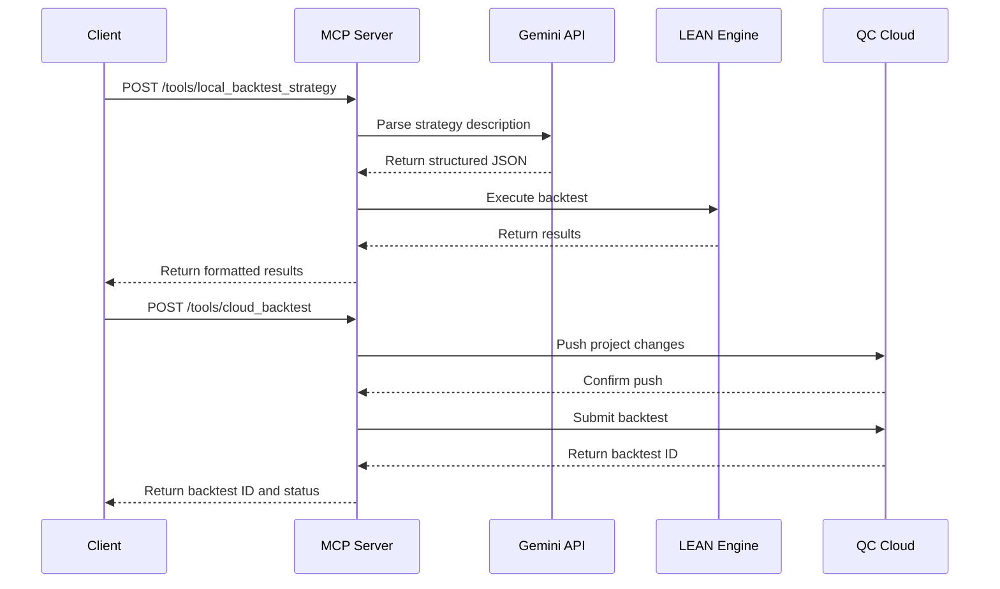
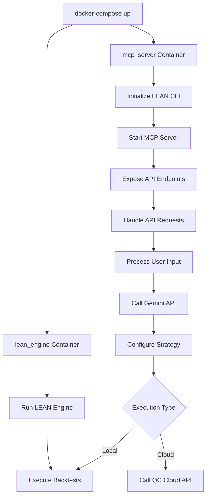

# AlphaForge Pipeline Flow

This document outlines the complete pipeline flow of AlphaForge, from natural language input to trading strategy execution.

## Overview

AlphaForge bridges the gap between natural language descriptions of trading strategies and their implementation in QuantConnect's LEAN engine. The system provides both local backtesting capabilities and cloud integration.



## Detailed Pipeline Flow

### 1. Natural Language Processing

**Input**: User provides a natural language description of a trading strategy.

**Example**:
```
"Backtest a simple moving average crossover on SPY from 2021-01-01 to 2023-12-31 using 50 and 200 day SMAs."
```

**Process**:
1. The input is sent to the `parse_gemini_response` function in `src/nlp/gemini_parser.py`
2. The function constructs a prompt for the Gemini API
3. Gemini processes the natural language and returns a structured JSON response
4. The parser extracts and validates the JSON, adding default values if needed

**Output**:
```json
{
  "action": "backtest",
  "strategy_details": "simple moving average crossover using 50 and 200 day SMAs",
  "symbols": ["SPY"],
  "start_date": "2021-01-01",
  "end_date": "2023-12-31",
  "strategy_type": "moving_average_crossover",
  "parameters": {
    "short_window": 50,
    "long_window": 200
  }
}
```

### 2. Strategy Configuration

The parsed JSON is used to configure the trading strategy. This can happen in two ways:

#### 2.1 Local Strategy Configuration

For local backtesting, the system:
1. Selects an appropriate algorithm template (e.g., `BasicTemplateAlgorithm.py`)
2. Configures the algorithm parameters based on the parsed JSON
3. Prepares the LEAN engine configuration

**Code Flow**:
```python
# In src/mcp_server/server.py
@Tool(
    name="local_backtest_strategy",
    description="Run LEAN backtest LOCALLY from natural language input",
    params={"strategy_description": "str"}
)
async def local_backtest(_, strategy_description: str):
    from ..nlp.gemini_parser import parse_gemini_response 
    config = parse_gemini_response(strategy_description)
    
    # Get algorithm identifier from config
    algorithm_identifier = config.get('algorithm_path', 
                                     config.get('strategy_type', 'BasicTemplateAlgorithm'))
    
    # Execute LEAN command
    lean_command = f"backtest {algorithm_identifier}" 
    result = await self.lean.execute(lean_command)
    
    return {
        "status": "success" if result.get("success") else "error",
        "details": result.get("output") or result.get("error") 
    }
```

#### 2.2 Cloud Strategy Configuration

For cloud backtesting, the system:
1. Validates the strategy parameters
2. Pushes the local project to QuantConnect Cloud
3. Configures the cloud backtest with the parameters

**Code Flow**:
```python
# In src/mcp_server/tools.py
@Tool(
    name="cloud_backtest",
    description="Run a backtest on QuantConnect Cloud",
    params={
        "project_name": "str",
        "strategy_parameters": "dict",
        "backtest_name": "Optional[str]"
    }
)
async def cloud_backtest(self, 
                       project_name: str,
                       strategy_parameters: Dict,
                       backtest_name: Optional[str] = None) -> Dict:
    # Validate input
    symbol = strategy_parameters.get('symbol')
    if symbol:
         self._validate_symbol(symbol)
    
    # Push project to cloud
    push_result = await self.qc_bridge.push_changes(project_name)
    
    if not push_result["success"]:
        return self._format_error("Push failed", push_result.get("error", "Unknown push error"))
    
    # Submit backtest
    bt_result = await self.qc_bridge.submit_cloud_backtest(
        project_name,
        backtest_name
    )
    
    # Extract backtest ID
    backtest_id = None
    if bt_result["success"]:
         backtest_id = self._extract_backtest_id(bt_result["output"])
    
    return {
        "status": "success" if bt_result["success"] else "error",
        "backtest_id": backtest_id,
        "details": bt_result
    }
```

### 3. Execution

#### 3.1 Local Execution

For local backtesting:
1. The LEAN engine is invoked via the `LeanBridge` class
2. The engine executes the backtest with the configured parameters
3. Results are captured and returned

**Code Flow**:
```python
# In src/mcp_server/bridge.py
async def execute(self, command: str):
    """Execute LEAN CLI command inside the container"""
    full_command = f"lean {command}"
    process = await asyncio.create_subprocess_shell(
        full_command,
        stdout=subprocess.PIPE,
        stderr=subprocess.PIPE
    )
    stdout, stderr = await process.communicate()
    
    return {
        "success": process.returncode == 0,
        "output": stdout.decode(errors='replace') if stdout else "",
        "error": stderr.decode(errors='replace') if stderr else "",
        "return_code": process.returncode
    }
```

#### 3.2 Cloud Execution

For cloud backtesting:
1. The QuantConnect Cloud API is invoked via the `QuantConnectCloudBridge` class
2. The cloud executes the backtest with the configured parameters
3. A backtest ID is returned for tracking

**Code Flow**:
```python
# In src/integrations/qc_cloud.py
async def submit_cloud_backtest(self, project_name_or_id: str, backtest_name: str | None = None) -> dict:
    """Submits a backtest job to QuantConnect Cloud for a specific project."""
    safe_project_arg = shlex.quote(project_name_or_id)
    command = f"cloud backtest {safe_project_arg}"
    
    if backtest_name:
        command += f" --backtest-name {shlex.quote(backtest_name)}"
    
    return await self._execute_lean_command(command)
```

### 4. Results Processing

#### 4.1 Local Results

Local backtest results are processed and returned directly to the user.

**Code Flow**:
```python
# Results are returned from the local_backtest tool
return {
    "status": "success" if result.get("success") else "error",
    "details": result.get("output") or result.get("error") 
}
```

#### 4.2 Cloud Results

Cloud backtest results can be retrieved using the backtest ID.

**Code Flow**:
```python
# In src/integrations/qc_cloud.py
async def get_backtest_results(self, project_name_or_id: str, backtest_id: str) -> dict:
    """Fetches results for a specific cloud backtest."""
    # This is a placeholder in the current implementation
    # In a full implementation, it would use the LEAN CLI or QC API to fetch results
    print(f"Fetching results for backtest {backtest_id} in project {project_name_or_id}")
    return {"success": False, "error": "Fetching specific backtest results via CLI not fully implemented/verified."}
```

## API Flow

The entire pipeline is exposed through a RESTful API provided by the MCP server.

### API Endpoints

1. **Tools Endpoints**:
   - `/tools/local_backtest_strategy`: Run a local backtest from natural language
   - `/tools/cloud_backtest`: Run a cloud backtest with specific parameters
   - `/tools/push_project`: Push local changes to QuantConnect Cloud
   - `/tools/download_market_data`: Download market data (placeholder)

2. **Resource Endpoints**:
   - `/resources/cloud_projects`: List available QuantConnect Cloud projects
   - `/resources/risk_parameters`: Get risk management settings

### Example API Flow



## Docker Container Flow

AlphaForge runs in Docker containers to ensure consistent environments.



## Complete End-to-End Example

### 1. User Input
```
"Backtest a mean reversion strategy for AAPL using RSI with a 14-day period, buying when RSI is below 30 and selling when it's above 70, from 2022-01-01 to 2022-12-31."
```

### 2. Gemini Parsing
```json
{
  "action": "backtest",
  "strategy_details": "mean reversion strategy using RSI indicator",
  "symbols": ["AAPL"],
  "start_date": "2022-01-01",
  "end_date": "2022-12-31",
  "strategy_type": "mean_reversion",
  "parameters": {
    "indicator": "RSI",
    "period": 14,
    "buy_threshold": 30,
    "sell_threshold": 70
  }
}
```

### 3. Strategy Configuration
The system selects the appropriate algorithm template and configures it with the parsed parameters.

### 4. Execution
The backtest is executed either locally or in the cloud, depending on the user's choice.

### 5. Results
The backtest results are returned to the user, including performance metrics, trade history, and equity curve.

## Conclusion

The AlphaForge pipeline provides a seamless flow from natural language strategy descriptions to executable trading strategies. By leveraging the power of Gemini for natural language processing and QuantConnect's LEAN engine for backtesting, it enables rapid strategy development and testing.
